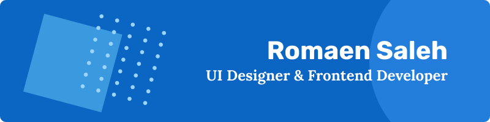

## Designer | Developer | Creator
💻 Really enjoy building things from scratch and to see it through  
😤 I am a really passionate person and I like to wear it on my sleeve.  
🎮 Love playing tennis, video games, reading comics and watching shows.  
✉️ **Email me:** romaenwritescode@gmail.com

## Social
[Website](http://noodlesjs.dev) | [Behance](https://www.behance.net/romaen) | [Dribble](https://dribbble.com/NoodlesJS)

[Twitter](https://twitter.com/CodingNoodles) | [Instagram](https://www.instagram.com/noodles.js/) | [Linkedin](https://www.linkedin.com/in/romaen-saleh/)

## Tools and Technologies
- **DESIGN**

   

- **DEVELOPMENT**

  

